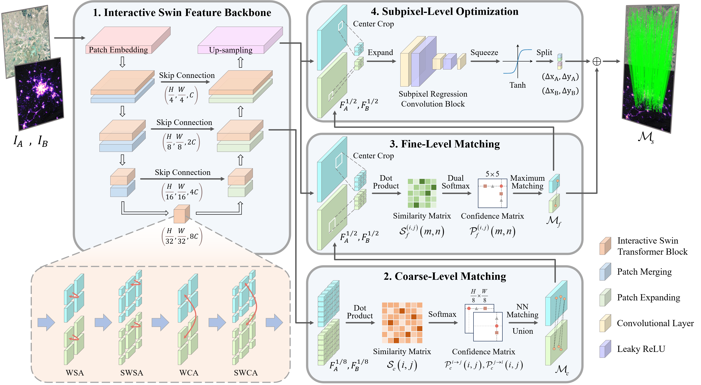

# SwinMatcher: Universal Cross-Modal Remote Sensing Image Matching with Interactive Swin Transformer

Paper Link: https://ieeexplore.ieee.org/document/11095750



Tip: You may want to check out another method [\[Link\]](https://github.com/LotrL/DGIM), which offers better performance.


## 💾 Model Weights

Google Drive: https://drive.google.com/drive/folders/1R4u8TBHzcv8dM1vTRyKwFxS7dCeAd31q?usp=drive_link

Baidu Netdisk: https://pan.baidu.com/s/1Thzdd-sqFNOqXBD10KYBnA?pwd=swin


## 📦 Datasets Release

Google Drive: https://drive.google.com/file/d/1SykpYFGL2_GxJDtm6RXUd7nnEqj0ra0Q/view?usp=drive_link

Baidu Netdisk: https://pan.baidu.com/s/1cvpKmblf9JPlEXmv444DwA?pwd=swin


## 📚 Citation
```bibtex
@article{li2025swinmatcher,
  title={{SwinMatcher}: Universal Cross-Modal Remote Sensing Image Matching with Interactive Swin Transformer},
  author={Li, Wei and Weng, Desheng and Gao, Chenzhong and Du, Qian},
  journal={IEEE Transactions on Geoscience and Remote Sensing},
  year={2025},
  volume={63},
  pages={1-16},
  publisher={IEEE}
}
```
